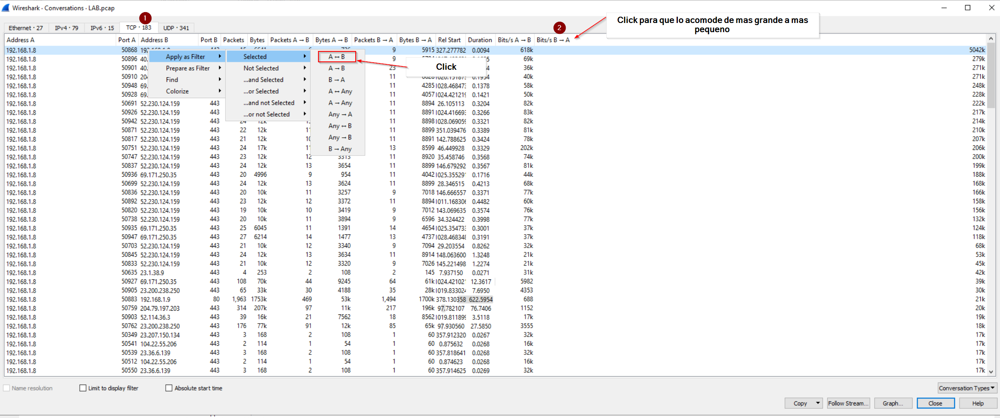

# Pretium

## Scenario

`The Security Operations Center at Defense Superior are monitoring a customer’s email gateway and network traffic (Crimeson LLC). One of the SOC team identified some anomalous traffic from Josh Morrison’s workstation, who works as a Junior Financial Controller. When contacted Josh mentioned he received an email from an internal colleague asking him to download an invoice via a hyperlink and review it.`

 `The email read:`

*`There was a rate adjustment for one or more invoices you previously sent to one of our customers. The adjusted invoices can be downloaded via this [link] for your review and payment processing. If you have any questions about the adjustments, please contact me.`*

*`Thank you.`*

*`Jacob`*

 *`Tomlinson, Senior Financial Controller, Crimeson LLC.*The SOC team immediately pulled the email and confirmed it included a link to a malicious executable file. The Security Incident Response Team (SIRT) was activated and you have been assigned to lead the way and help the SOC uncover what happened.You have NetWitness and Wireshark in your toolkit to help find out what happened during this incident.**Reading Material:**`

[SANS Internet Storm Center SANS Internet Storm Center - A global cooperative cyber threat / internet security monitor and alert system. Featuring daily handler diaries with summarizing and analyzing new threats to networks and internet security events.SANS Internet Storm Centerisc, sans, internet, security, threat, worm, virus, phishing, hacking, vulnerability](https://isc.sans.edu/forums/diary/An+Introduction+to+RSA+Netwitness+Investigator/18199/)

[PCAP analysis basics with Wireshark [updated 2021] - Infosec Resources](https://resources.infosecinstitute.com/topic/pcap-analysis-basics-with-wireshark/)

[SANS Internet Storm Center SANS Internet Storm Center - A global cooperative cyber threat / internet security monitor and alert system. Featuring daily handler diaries with summarizing and analyzing new threats to networks and internet security events.SANS Internet Storm Centerisc, sans, internet, security, threat, worm, virus, phishing, hacking, vulnerability](https://isc.sans.edu/forums/diary/Packet+Tricks+with+xxd/10306/)

---

## Writeup

[BTLO - Pretium](https://medium.com/btlo-investigation-solutions/btlo-pretium-db6d8e8b3608)

## Question 1

What is the full filename of the initial payload file?

`INVOICE_2021937.pdf.bat`

Abrimos el pcap en wireshark y como sabemos que fue un empleado interno `192.168.1.9` y nuestro IP es `192.168.1.8` vamos a `Stadistics` → `Conversation` y marcamos cual es el paquerte mas grande que se transferio y le damos `right-click` para que lo para preparar el filtro que queremos `A<->B` y le damos enter.

Vamos un get con un Invoice.pdf pero tambien tiene la extension poco usual de `.bat` le vamos a dar `right-click` → `Follow` → `TCP Stream` y vamos a ver la conversacion completa

---

## Question 2

What is the name of the module used to serve the malicious payload?*(4 points)*

`SimpleHTTPserver`

Como podemos ver en el 200 OK de donde bajamos el file podemos ver donde dice `Server:`

`SimpleHTTP/0.6 Python/3.8.5` que es un modulo de Python para montar un server para que bajen cosas como podemos ver en screenshot

---

## Question 3

Analysing the traffic, what is the attacker's IP address?*(4 points)*

`192.168.1.9`

Como podemos ver en el Pcap y en el GET request bajamos el file de atacante con el IP 192.168.1.9

---

## Question 4

Now that you know the payload name and the module used to deliver the malicious files, what is the URL that was embedded in the malicious email?*(5 points)*

`INVOICE_2021937.pdf.bat`

Toda esta informacion lo vimos en las anteriores preguntas solo necesitamos juntarlo todo

---

## Question 5

Find the PowerShell launcher string (you don’t need to include the base64 encoded script)*(5 points)*

`powershell -noP -sta -w 1 -enc`

En mismo sitio encontramos la respuesta a la pregunta

---

## Question 6

What is the default user agent being used for communications?*(4 points)*

`Mozilla/5.0`

Despues de decryptar la base64 encontramos el User Agent que es `Mozilla/5.0`

---

## Question 7

You are seeing a lot of HTTP traffic. What is the name of a process where malware communicates with a central server asking for instructions at set time intervals?*(4 points)*

`beaconing`

Si buscamos como se llama cuando se comunica un a un C2 vamos a ver beaconing

---

## Question 8

What is the URI containing ‘login’ that the victim machine is communicating to?*(5 points)*

`/login/process.php`

Si buscamos en Wireshark con el filtro `http` podemos ver que hay un `Post` request a `/login/process.php`

---

## Question 9

What is the name of the popular post-exploitation framework used for command-and-control communication?*(5 points)*

`Empire`

Si buscamos en google podemos ver que la respuesta es `Empire`

---

## Question 10

It is believed that data is being exfiltrated. Investigate and provide the decoded password*(5 points)*

`Y0uthinky0ucAnc4tchm3$$`

Lo primero que vamos a hacer en Wireshark vamos a usar este filtro `icmp && ip.src==192.168.1.8 && ip.dst==192.168.1.9` Vamos a marcar el primer paquete y vamos a `File Menu` y luego `Export Specified Packers` y lo guardamos.

Despues con T-shark que lo tenemos en la maquina vamos a donde lo tenemos instalado en el `CMD` y escribimos el siguente comando

``.\tshark.exe -r C:\Users\BTLOTest\Desktop\Investigation\<nombre que le pusimos al pcap>.pcap -T fields -e data`

Nos van a salir un monton de hexadecimales como en el screenshot

Vamos a copiarlos todos los hexadecimales y los vamos a poner en Cyberchef con estas recetas

---

## Question 11

What is the account’s username?*(5 points)*

`$sec-account`

En el mismo que descryptamos anteriormente y vimos el password tambien podemo ver el Username que estamos buscando

